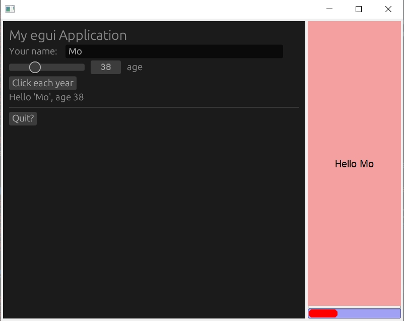

# fltk-egui

An FLTK backend for Egui using a GlWindow.

## To use on Linux
Install FLTK deps:
```bash
sudo apt-get update && sudo apt-get install -y libpango1.0-dev libx11-dev libxext-dev libxft-dev libxinerama-dev libxcursor-dev libxrender-dev libxfixes-dev libgl1-mesa-dev libglu1-mesa-dev libmpv-dev
```
and then install egui deps:
```bash
sudo apt-get update && sudo apt-get install -y libxcb-render0-dev libxcb-shape0-dev libxcb-xfixes0-dev libspeechd-dev libxkbcommon-dev libssl-dev
```

## Usage
Add to your Cargo.toml:
```toml
[dependencies]
fltk-egui = "0.7" # targets egui 0.18
```
On wayland desktop enable feature:
```toml
[dependencies]
fltk-egui = { version = "0.7",  features = ["wayland"] }
```

The basic premise is that egui is an immediate mode gui, while FLTK is retained. To be able to run Egui code, events and redrawing would need to be handled/done in the FLTK event loop. The events are those of the GlWindow, which are sent to egui's event handlers. Other FLTK widgets can function also normally since there is no interference from Egui.
Please check the [basic example](examples/basic.rs).

## Examples
To run the examples, just run:
```
$ cargo run --example demo_windows
$ cargo run --example triangle
$ cargo run --example basic
$ cargo run --example embedded
```

A demo app can be found here:
https://github.com/fltk-rs/demos/tree/master/egui-demo

- [embedded](examples/embedded.rs)
- 
